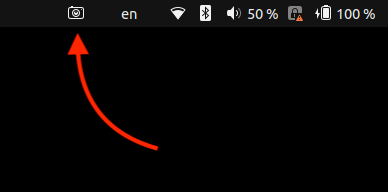

# gnome-screenshort-cut-extension

A simple shortcut button to call the native screenshot tool directly on your GNOME panel.



[](https://extensions.gnome.org/extension/6868/screenshort-cut)

## Packing the extension

```sh
gnome-extensions pack --out-dir=./dst ./src
```
